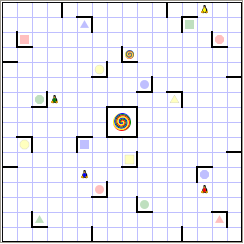

# Ricochet Robots Solver

A collection of crates for solving the board game [ricochet robots](https://en.wikipedia.org/wiki/Ricochet_Robot).

Ricochet Robots is a puzzle game played on a 16x16 grid board.
The player can move robots of four different colors and tries to move a robots to a target of the same color with as few moves as possible.
Robots can only move in straight lines until they hit an obstacle, a wall or another robot.
Any robot can be moved at any point.
The player to find the shortest path gets a token.
After every target on the board has been visited the player with the most tokens wins.



## Table of contents

- [Ricochet Robots Solver](#ricochet-robots-solver)
    - [Table of contents](#table-of-contents)
    - [CLI Quick start](#cli-quick-start)
    - [Project structure](#project-structure)
        - [Board](#board)
        - [Solvers](#solvers)
        - [CLI](#cli)
        - [RL environment](#rl-environment)
        - [Solution generator](#solution-generator)
        - [Ongoing experiments](#ongoing-experiments)
    - [Building from source](#building-from-source)
        - [Rust parts](#rust-parts)
        - [Python parts](#python-parts)
        - [Builds compatible with `manylinux`](#builds-compatible-with-manylinux)
    - [Performance evaluation](#performance-evaluation)
    - [Documentation](#documentation)
    - [Planned features](#planned-features)
    - [Contributing](#contributing)
    - [Board editor](#board-editor)

## CLI Quick start

Use `cargo run --release` to use the cli tool and solve a game.

You will first have to select the board quarters which make up the board, starting from the upper left and rotating clockwise. They are assigned colors depending on their actual board game counterparts.
After that the locaitons of the robots on the board have to be specified, starting from the upper left corner with `(1,1)` meaning column `1` and row `1`. Confirm your choices and get an optimal solution.

See [Building from source](#building-from-source) for getting cargo.

## Project structure

This project is split into multiple parts to make management of the codebase easier and more modular:

### Board

The base which everything builds upon is in `ricochet_board`.
It contains the implementation of the board and game logic. Besides that anything related to creating boards is also located there, whether it's putting board quadrants of the physical board together or even randomly generating boards of any size.

### Solvers

Multiple solvers have been implemented to find optimal solutions.

Given a board, a target and the robots start positions any move of a robot can be seen as moving along an axis in an undirected graph to another state. This means path finding algorithms can be used to traverse this graph to find the shortest path to a state with the main robot on the target.

So far these algorithms have been implemented and optimized for riochet robots (sorted by fastest to slowest):

| Algorithm               | Finds the shortest path? |
| ----------------------- | ------------------------ |
| A*                      | yes                      |
| Iterative deepening A*  | yes                      |
| Breadth-first search    | yes                      |
| Monte Carlo tree search | no                       |

See the [documentation](#documentation) and the [performance evaluation](#performance-evaluation) for more information.

### CLI

The command line tool called `ricli` can be used to solve problems on the standard physical board. See [CLI quick start](#cli-quick-start) for more information.

### RL environment

The `ricochet_env` folder contains a reinforcement learning environment written in rust and its python bindings.
It allows for customization of the environment in regards to board size, how the board is chosen/generated, target type and location and robot positions.
The `ricochet_env` package has to be installed in the virtual environment, see [Building from source](#building-from-source) for instructions.

The package can be used like this:

```python
from ricochet_env import RicochetEnv

env = RicochetEnv()
env.step(0)
env.step(1)
(observation, reward, done, info) = env.step(2)
assert(reward == 1.0)

env.reset()
(observation, reward, done, info) = env.step(0)
assert(reward == 0.0)
```

### Solution generator

The `solution_generator` randomly builds standard 16x16 boards like they could be put together from the physical board quadrants and solves with randomly generated robot positions. This has been optimized to utilize all cores on the machine.
The found solutions are written out as a csv file. To use the generator you have to navigate into the directory.

### Ongoing experiments

The directory `experiments` contains ongoing work to implement an reinforcement learning agent based on the [Rainbow Agent](https://arxiv.org/abs/1710.02298) by DeepMind. The agent can currently learn to find the path in simple environments but fails to learn anything if the target's type and position are variable.

## Building from source

### Rust parts

Building from source requires a stable rust compiler which can be installed using [rustup](https://rustup.rs/).
If no python interop is needed, the rust code can be compiled with `cargo build --release` or run with `cargo run --release`.

### Python parts

The following is only necessary if you plan to build the python RL environment.

At least Python 3.6 is required and a virtual environment has to be used, e.g. conda. To create python packages from rust code, install [maturin](https://pypi.org/project/maturin/) in the environment.

```bash
pip install maturin
```

To build the environment either call `maturin develop --release` in the `ricochet_env` directory or from the project root call

```bash
$ maturin develop --release --manifest-path ricochet_environment/Cargo.toml 
🍹 Building a mixed python/rust project
🔗 Found pyo3 bindings
🐍 Found CPython 3.8 at python3
    Finished release [optimized] target(s) in 0.03s
```

`maturin build` can be used instead to build but not install the package. The built `.whl` file can be found in `target/wheels/` and can be installed using pip.

### Builds compatible with `manylinux`

To build the package in a way that makes it compatible with manylinux use:

```bash
docker run --rm -v $(pwd):/io konstin2/maturin build --release --manifest-path /io/ricochet_environment/Cargo.toml
```

The built wheels will be located in `/target/wheels/`.

## Performance evaluation

A simple performance evaluation of the optimal algotihms breadth-first search (BFS), iterative deepening A\* (IDA*) and A* can be found in [evaluation.md](evaluation.md).

The Monte Carlo tree search is not optimal and often even far from optimal and high in variance, so the performance could not be meanigfully evaluated.

The training performance of the rainbow agent is documented in the images of the training in the `experiments` directory and with some description in [evaluation.md](evaluation.md).

## Documentation

The documentation is besides the code and can be easily viewed by running `cargo doc --open`, to view the documenation of private code add `--document-private-items`.

## Planned features

- Draw boards and states as images
- Optimize solvers
    - sort robot positions to prune equivalent states
    - use a Trie to store visited positions
    - sort directions and robots to match the target when iterating over them
    - replace the `Vec<Vec<Field>>` with a multidimensional array
    - find a better scoring function for MCTS
- Further optimize the Rainbow agent
    - Use only two layers for the robots
        - One with the active robot
        - One with the other robots
    - One target channel to show the position and add the one-hot encoded target type to the dense layer

## Contributing

Any code to be included in the project has to be formatted with **rustfmt** and checked with **clippy**.
Make sure no tests are failing and run the benchmarks with and without your changes if the solvers were changed to see possible performance regressions.

## Board editor

Board editor written in elm hosted [here](https://lireer.github.io/ricochet-robot-solver/), but it's not really usable for anything other than moving pieces around.
