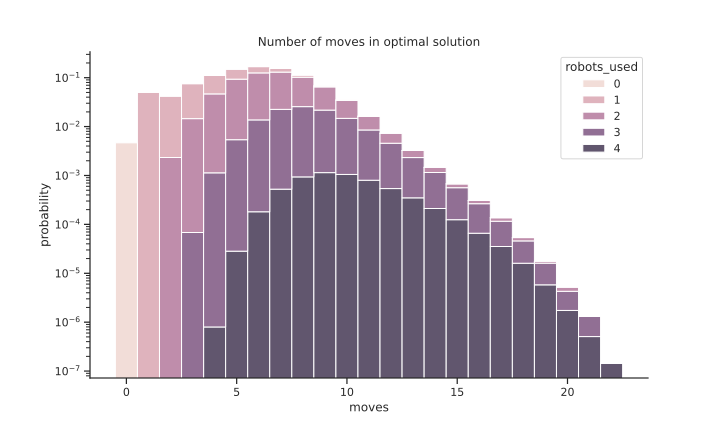
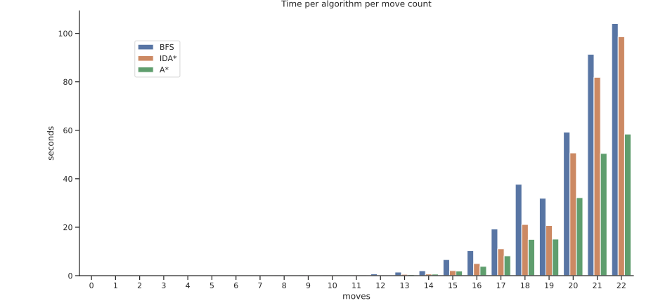
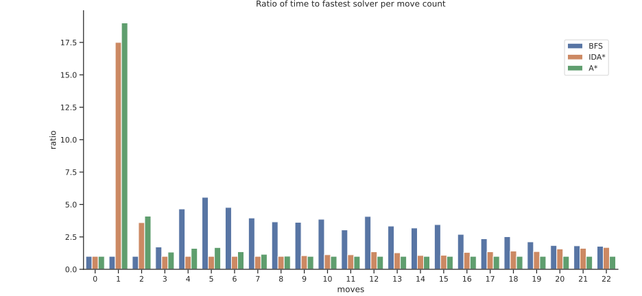
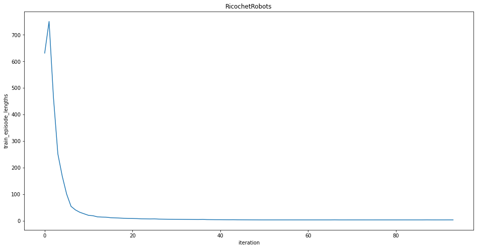
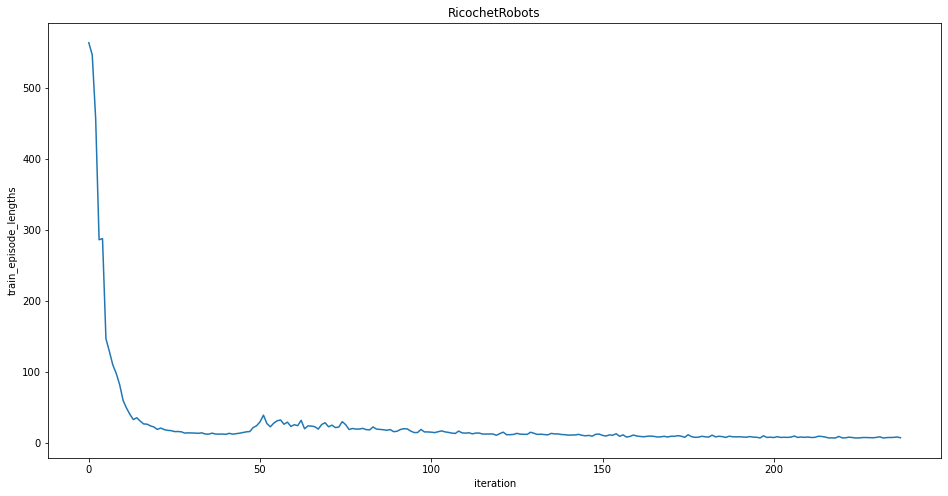
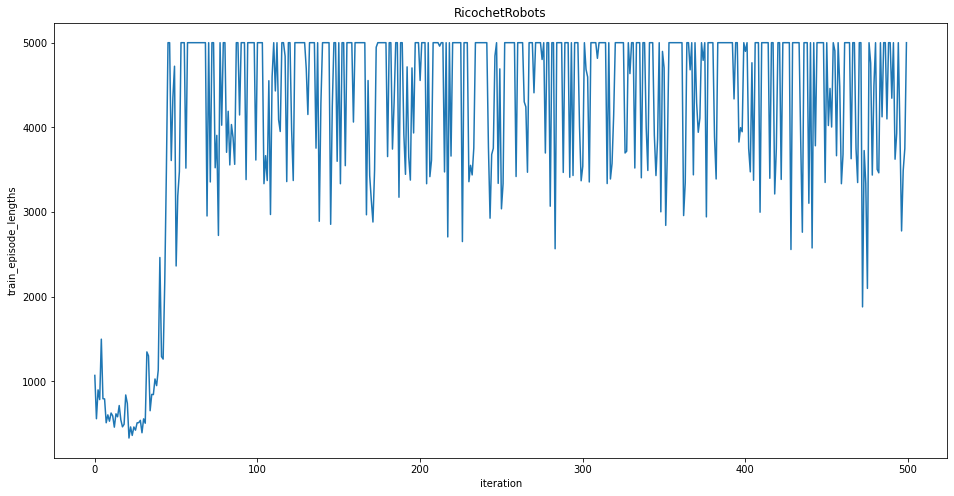
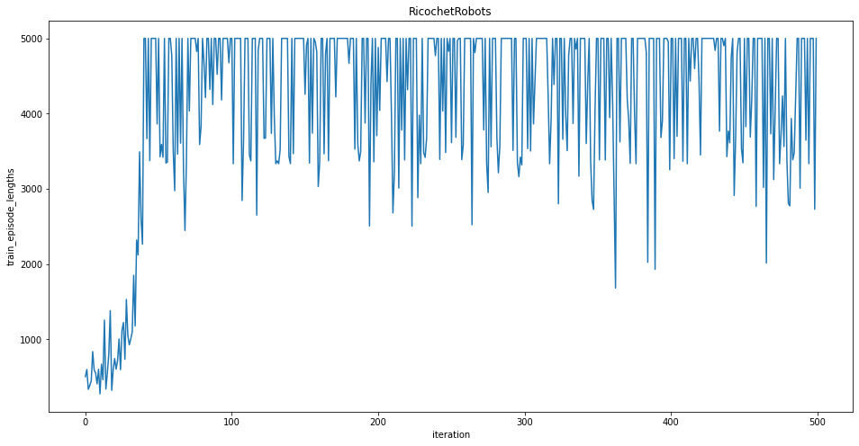

# Performance evaluation

## Game complexity

In an arbitrary ricochet robots environment deciding whether a given target can be reached is [NP-hard](https://www.researchgate.net/publication/220081690_Randolphs_Robot_Game_is_NP-hard).
That it's a hard problem can also be inferred from the branching factor of 16 with four robots and four directions they can move in. This means a brute force approach without any optimizations would have to visit $16^{10} = 2^{40}$ ≈ 1 trillion positions to find all positions which can be reached within 10 moves.

This makes optimizations like storing visited positions to prune search branches early necessary.
Given the distribution in the figure below (note the logarithmic y-scale), we know that any solver without such optimizations could never be of any practical use.

The data to generate the figure has been generated by computing about 13.7 million solutions on all boards which can be build from the standard board qudrants and choosing a target at random. The robots are placed on the board randomly.
This may be introducing a bias into the data, since they would start disproportionately often away from any walls, while they usually start from corners during a normal game.

An analysis of the data shows that the mean number of moves is ~5.85 with a standard deviation of ~2.48. The high std is reflected in the fact, that some board-target combinations have a mean of just above 3.3 moves while the combinations with the highest mean need up to 12 moves.

Higher move counts usually mean more robots need to be used to find an optimal path. But even so 3 solutions using only one robot exist at the 14 move count. The other extreme can be seen at 4 robots used to find a solution with 4 moves.

## Solver benchmarks

The time needed to compute a solution grows exponentially with the optimal number of moves needed to reach the target as can be seen in the figures below.

Both figures show the same data, the first with a linear y-scale to show the difference between the solvers.
This shows that A\* is almost twice as fast as BFS at 22 moves. The second figure uses a logarithmic scale to make the shorter times visible. This reveals the almost constant times for IDA\* and A\* from 1 to 3 moves. These are due to a relatively long computation which enables more optimizaitions in the long run using a heuristic.

The next figures helps with comparing the solvers performances relative to each other. For each move count the ratio of the time per solver to the fastest solver of this move count is displayed. A\* is the fastest solver for problems longer than 8 moves. The figure shows the long computation at the start of IDA\* and A\* even better. Computing the heuristic is what gives them an advantage compared to BFS, but as the number of needed moves grows larger, the advantage becomes smaller. BFS needs 1.78 times as long to solve a problem at 22 moves on average.

The optimizations implemented are mostly about visiting less positions. IDA\* and A\* are faster than BFS because they visit fewer positions as can be seen in the row `unsorted` in the table below. The table also shows the possible gains which could be achieved by further optimizing the searches to use sorted robot positions to prune equivalent parts of the search tree.

| 22 moves   |        BFS |      IDA\* |        A\* |
| ---------- | ---------: | ---------: | ---------: |
| unsorted   | 44.273.696 | 17.952.410 | 14.356.616 |
| sorted     | 17.836.625 | 11.689.819 |  7.566.744 |
| change     | 26.437.071 |  6.262.591 |  6.789.872 |
| change (%) |     -59.7% |     -34.9% |     -47.3% |

The table containing the data shown in the figures can be found in the [Appendix](#appendix)

## Rainbow agent

The training performance of the rainbow agent depends heavily on the configuration of the environment.
The following figures show the episode lengths achieved during training in different environments with a board size of 6x6.

**Easiest environment**:

- Fixed walls
- Fixed target position and type
- Fixed robot positions

**Random robots environment**:

- Fixed walls
- Fixed target position and type
- Random robot positions

**Random targets/robots environment**:

- Fixed walls
- Varying target positions and types (about 2-3 different positions, 5 different types)
- Random robot positions

The agent is not able to learn anything.

**Small standard environment**:

- 32 different boards
- Varying target positions and types for each board
- Random robot positions

Again the agent is not able to learn anything.

## Appendix

| Moves | Algorithm | Average microseconds needed | ratio to fastest |
| ----: | --------- | --------------------------: | ---------------: |
|     0 | BFS       |                           1 |              1.0 |
|     0 | IDA*      |                           1 |              1.0 |
|     0 | A*        |                           1 |              1.0 |
|     1 | BFS       |                           2 |              1.0 |
|     1 | IDA*      |                          35 |             17.5 |
|     1 | A*        |                          38 |             19.0 |
|     2 | BFS       |                          10 |              1.0 |
|     2 | IDA*      |                          36 |              3.6 |
|     2 | A*        |                          41 |              4.1 |
|     3 | BFS       |                          69 |             1.72 |
|     3 | IDA*      |                          40 |              1.0 |
|     3 | A*        |                          53 |             1.32 |
|     4 | BFS       |                         349 |             4.65 |
|     4 | IDA*      |                          75 |              1.0 |
|     4 | A*        |                         121 |             1.61 |
|     5 | BFS       |                        1322 |             5.55 |
|     5 | IDA*      |                         238 |              1.0 |
|     5 | A*        |                         400 |             1.68 |
|     6 | BFS       |                        4152 |             4.77 |
|     6 | IDA*      |                         870 |              1.0 |
|     6 | A*        |                        1182 |             1.35 |
|     7 | BFS       |                       11039 |             3.96 |
|     7 | IDA*      |                        2787 |              1.0 |
|     7 | A*        |                        3237 |             1.16 |
|     8 | BFS       |                       26590 |             3.65 |
|     8 | IDA*      |                        7266 |              1.0 |
|     8 | A*        |                        7359 |             1.01 |
|     9 | BFS       |                       62840 |             3.62 |
|     9 | IDA*      |                       18245 |             1.05 |
|     9 | A*        |                       17334 |              1.0 |
|    10 | BFS       |                      141588 |             3.86 |
|    10 | IDA*      |                       41216 |             1.12 |
|    10 | A*        |                       36646 |              1.0 |
|    11 | BFS       |                      280544 |             3.03 |
|    11 | IDA*      |                      103607 |             1.12 |
|    11 | A*        |                       92352 |              1.0 |
|    12 | BFS       |                      720817 |             4.07 |
|    12 | IDA*      |                      238396 |             1.34 |
|    12 | A*        |                      176749 |              1.0 |
|    13 | BFS       |                     1464060 |             3.33 |
|    13 | IDA*      |                      558983 |             1.27 |
|    13 | A*        |                      438989 |              1.0 |
|    14 | BFS       |                     2037295 |             3.18 |
|    14 | IDA*      |                      682172 |             1.06 |
|    14 | A*        |                      639150 |              1.0 |
|    15 | BFS       |                     6641841 |             3.44 |
|    15 | IDA*      |                     2088551 |             1.08 |
|    15 | A*        |                     1926866 |              1.0 |
|    16 | BFS       |                    10329020 |             2.69 |
|    16 | IDA*      |                     5004116 |             1.30 |
|    16 | A*        |                     3830697 |              1.0 |
|    17 | BFS       |                    19248221 |             2.35 |
|    17 | IDA*      |                    11079111 |             1.35 |
|    17 | A*        |                     8175632 |              1.0 |
|    18 | BFS       |                    37693624 |             2.51 |
|    18 | IDA*      |                    21131318 |             1.41 |
|    18 | A*        |                    14972170 |              1.0 |
|    19 | BFS       |                    31948172 |             2.11 |
|    19 | IDA*      |                    20705085 |             1.37 |
|    19 | A*        |                    15092639 |              1.0 |
|    20 | BFS       |                    59263902 |             1.84 |
|    20 | IDA*      |                    50652130 |             1.57 |
|    20 | A*        |                    32185093 |              1.0 |
|    21 | BFS       |                    91375715 |             1.81 |
|    21 | IDA*      |                    81854396 |             1.62 |
|    21 | A*        |                    50433655 |              1.0 |
|    22 | BFS       |                   104057047 |             1.78 |
|    22 | IDA*      |                    98616898 |             1.68 |
|    22 | A*        |                    58436810 |              1.0 |
